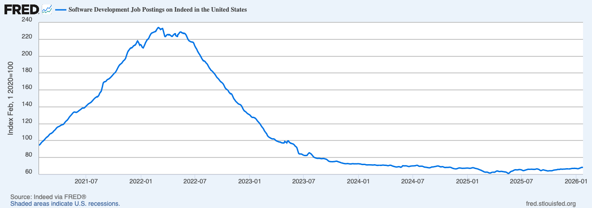

## The Future of Software Engineering

It was a Saturday afternoon. The kids were running loose in the basement — my 3-year-old, his friend, the 1-year-old — noise and mess everywhere. I was chatting with the mom of my son's friend when we landed on the AI topic. She mentioned someone at her workplace, a developer on a temporary contract, struggling to find a full-time job.

She asked what I'd suggest. I fumbled something about the market being tough for entry levels, about building a public portfolio. Decent advice, I guess. But walking away, I wasn't sure I believed it.

Not even 24 hours later, over a Brazilian-style lunch with an old colleague in the cold of Canada, we had the same conversation. What's the future of this career?

I bet you've had this conversation too. You might be worried about it. I know I am.

On X, people are spawning new products in minutes and claiming to make tons of money. On the other side, people say your job is safe because AI introduces too many errors to be reliable.

**Both camps are missing the point.**

The job market is slowing down:

Jobs haven't disappeared — I still get the occasional recruiter email. But as tools get better, more code is being shipped [without anyone reviewing it](https://youtu.be/G-ycOHGNoRc?si=bWCJeyO-tw_YI1gT&t=1249). That trend means three things: we ship faster, there's an overload of new products and features, and companies need fewer people to build them.

While writing this, OpenAI posted [a piece](https://ttemp.link/Vv8bgO3) on building an application without humans writing any code. That landed for me because it matches where I'm already headed.

**I don't think we'll be writing much code in the near future. I'm starting now, and within a year, this will be the norm everywhere.**

So here's what I'm doing — and what I'd tell anyone who asked over coffee:

- **All documentation lives in the repo.** No more Google Docs. GitHub Issues link to markdown files. LLMs work with what's in the codebase, so everything that matters needs to be there.
- **Types are strict and centralized.** Schema libraries like Zod and Valibot aren't optional anymore — they're how you give an LLM the constraints it needs to generate correct code.
- **Tests are treated as examples.** LLMs rely deeply on patterns. A solid test suite isn't just for confidence — it's the reference foundation that teaches the model how your code should behave.

I also came across [a piece by Matt Shumer](https://ttemp.link/DYd7vtQ) that felt alarmist but nailed two things: **AI is moving from assistant to autonomous worker**, and **early adoption is the leverage window.**

Here's the thing — many developers are wired to think "coding is what we do." It's not. We're problem solvers. And if you tried AI six months ago and thought it wasn't great, things have changed. A lot.

---

## Worth your time

- **[Harness engineering: leveraging Codex in an agent-first world](https://ttemp.link/Vv8bgO3)** — If AI is writing all the code, what does the engineering team actually do? This piece lays out the system and structure needed to ship products in that world.
- **[Something Big Is Happening](https://ttemp.link/DYd7vtQ)** — Alarmist tone aside, the core argument is hard to ignore: the window to get ahead of this shift is closing fast. Worth reading if you're still on the fence about when to act.

---

## From me lately

If we're going to lean on AI, we should know what each model is actually good at. I put the main ones head-to-head while [redesigning this site](https://ttemp.link/jaA0Jmw) — the results were not what I expected.
