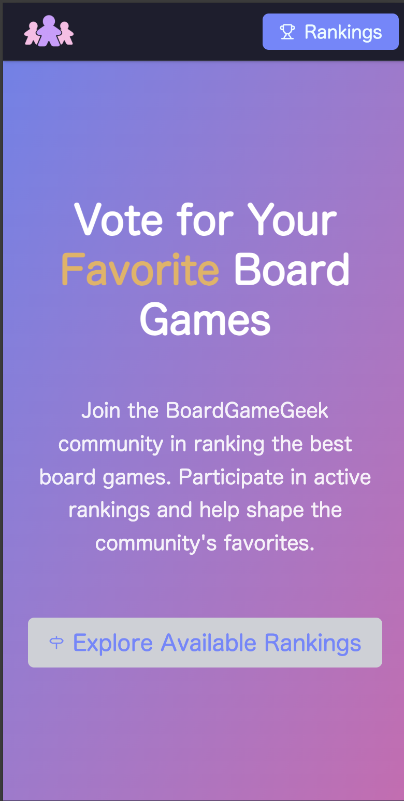
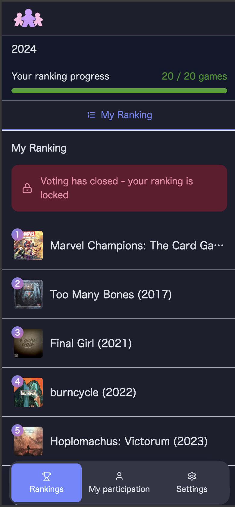
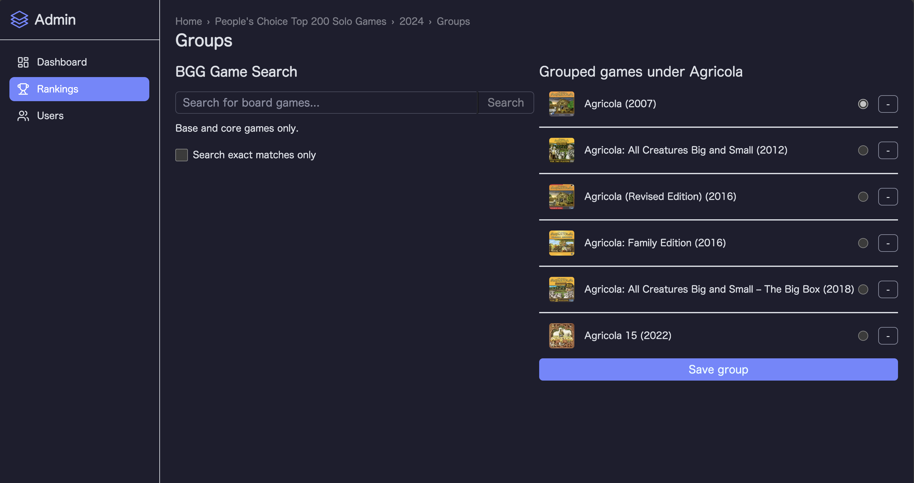

I’m a developer and a solo board gamer. For years, the BoardGameGeek (BGG) solo rankings ran on care and elbow grease—thousands of votes handled by hand. Eventually the volume caught up with the process; it was simply too much to keep doing manually. I built a small web app so the ritual could continue. This isn’t a framework comparison; it’s a note to anyone like me: you can help your communities by shipping a tiny tool.

Shipping outside work also reminded me I still know how to take something from idea → used. Last year, more than 1,700 people voted through the app. That felt good—not because of the tech, but because a tradition carried on.

Common ways this goes sideways:

- Treating it like a portfolio piece and overbuilding past the one painful step.
- Assuming “it’s just a hobby project,” so asking for third‑party usernames/passwords is fine.
- Keeping ambiguity in the workflow (free‑text names, manual dedupe) and drowning in cleanup.
- Trying to do it alone when helpers are right there, waiting for a place to jump in.

## Ship for your people, not your portfolio.

Here’s what I focused on:

- Start inside the community
- Ship with a stack I can actually ship with.
- Automate the ritual, not the culture.
- Make collaboration cheap.
- Design for trust.

## Start inside the community

After years of managing thousands of votes by hand, the process finally caught up with the volunteers. I was already part of the solo community, so I offered a small replacement instead of letting the tradition stall. If your community’s need isn’t as clear, a short “What tiny tool would help?” thread can surface it, and a few vocal testers are enough to keep you honest.

## Ship with a stack I can actually ship with

At work I’m mostly in React/React Router, but for this shape of app I’d had good hands‑on time with SvelteKit and found it simpler. I paired SvelteKit with Drizzle ORM and Supabase and focused on delivery over exploration. That let me model votes cleanly, wire server routes without friction, and deploy without babysitting. Your stack may differ; the point is to pick what makes *you* fast.

## Automate the ritual, not the culture

The goal is to have fun building a list of favorite games; the ritual is participating in the voting. I automated the parts that slow people down and that create confusion:

- **Ranking UI:** drag‑and‑drop ordering with autosave, plus min/max checks so ballots are valid by default.
- **Canonical IDs:** search through the BGG API so each pick maps to an exact game ID. No more guessing which “edition” someone meant.  
   That combination sped up voting and reduced cleanup while keeping the spirit of the rankings intact.

## Make collaboration cheap

Other people were willing to help; they just needed a way in. I added a small admin area so moderators could **relate games together**—for example, reissues or near‑duplicates—so results stayed tidy without a pile of manual messages. Be the first to move, then lower the bar so volunteers can handle the edge cases alongside you.

## Design for trust

Early on, the app asked for BGG usernames and passwords for verification. I didn’t store passwords, but that still made some folks uncomfortable—some chose not to vote; others voted and then changed their password. For the 2025 cycle (yet to happen as of writing), I’ve changed the approach so the app won’t ask for BGG passwords. That story deserves its own post; the short version is I’m collecting the minimum necessary and being explicit about what’s stored and why.

---

More than 1,700 people used the app last year, the tradition continued, and I rediscovered the confidence to ship something on my own. If you’re part of a community and see a small way to help, that’s enough reason to start.

[Check out the app](https://bggrankings.app)
